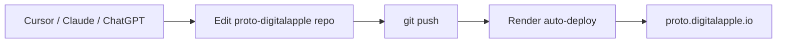

# Agentic deploy prototype (for Mohit)

## Goal

Publish HTML, CSS, and static packages **without a developer** — using Cursor, Claude, or ChatGPT.

## Architecture

## What we built

| Piece | Location |
|-------|----------|
| Static site | `index.html`, `css/`, `packages/` |
| GitHub | https://github.com/digitalapplein/proto-digitalapple |
| Render service | `proto-digitalapple` → https://proto-digitalapple.onrender.com |
| Custom domain | `proto.digitalapple.io` (DNS required) |
| Cursor skill | `.cursor/skills/proto-render-deploy/SKILL.md` |
| Manual deploy script | `scripts/deploy.ps1` |

## Prompt examples for agents

- “Add a new package under `packages/landing-v2/` with HTML and CSS, then deploy proto.”
- “Update the hero text on proto and push to Render.”
- “What DNS do we need for proto.digitalapple.io?”

## MCP / tooling matrix

| Capability | Tool |
|------------|------|
| Edit files | Cursor agent, filesystem MCP |
| Git push | Shell, GitHub MCP (`push_files`) |
| Trigger Render deploy | Shell + `RENDER_API_KEY`, or rely on auto-deploy |
| Custom domain verify | Render Dashboard or API `POST .../custom-domains/{name}/verify` |

## DNS (one-time, infra team)

In Render Dashboard → **proto-digitalapple** → Custom Domains, copy the CNAME target for `proto.digitalapple.io` and add the record at your DNS host for `digitalapple.io`.

## Security

- Store `RENDER_API_KEY` in password manager or CI secrets only
- Rotate keys if exposed in chat or logs
